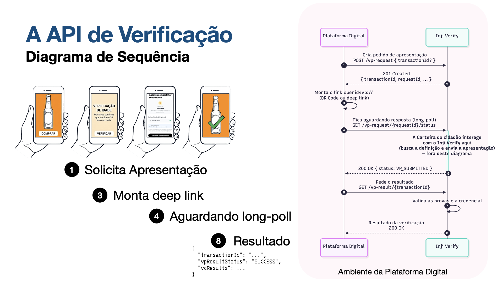

## Objetivo

Entender o ciclo completo de uma verificação de idade, do início ao resultado.

## Fluxo Same-Device via Deep Link

{fig-align="center" fig-cap="A API de Verificação — Diagrama de Sequência"}

## Fluxo Ponta a Ponta (Cross-Device — QR Code)

```{mermaid}
sequenceDiagram
    participant U as Usuário (Desktop)
    participant A as App React
    participant VS as INJI Verify Service
    participant W as Carteira Digital (Celular)

    U->>A: Clica "Verificar Idade"
    A->>VS: POST /v1/verify/vp-request
    VS-->>A: transactionId + requestId + requestUri
    A->>U: Exibe QR Code (openid4vp://authorize?client_id=...&request_uri=...)
    U->>W: Escaneia QR Code com a Carteira
    W->>VS: Apresenta credencial (VP submission)
    VS->>VS: Valida credencial + policy 18+
    Note over A,VS: App faz long-polling em /vp-request/{id}/status
    VS-->>A: status VP_SUBMITTED
    A->>VS: GET /v1/verify/vp-result/{transactionId}
    VS-->>A: vpResultStatus + vcResults
    A->>U: "Idade verificada!"
```

## Fluxo Same-Device (Deep Link — Mobile)

```{mermaid}
sequenceDiagram
    participant U as Usuário (Celular)
    participant A as App React Native
    participant VS as INJI Verify Service
    participant W as Carteira Digital

    U->>A: Toca "Verificar Idade"
    A->>VS: POST /v1/verify/vp-request
    VS-->>A: transactionId + requestId + requestUri
    A->>W: Abre Deep Link (openid4vp://authorize?client_id=...&request_uri=...)
    W->>VS: Apresenta credencial (VP submission)
    Note over W: Usuário volta ao app
    A->>VS: Long-polling /vp-request/{id}/status
    VS-->>A: status VP_SUBMITTED
    A->>VS: GET /v1/verify/vp-result/{transactionId}
    VS-->>A: vpResultStatus + vcResults
    A->>U: "Idade verificada!"
```

## O que a aplicação faz internamente

1. **Cria a VP Request** — `POST /v1/verify/vp-request` com a `presentationDefinition`
2. **Monta o Deep Link** — `openid4vp://authorize?client_id=...&request_uri=...` usando o `requestUri` retornado
3. **Exibe QR Code** — renderiza o deep link com `qrcode.react` para fluxo cross-device
4. **Long-polling** — consulta `GET /v1/verify/vp-request/{requestId}/status` até receber `VP_SUBMITTED` ou `EXPIRED`
5. **Busca resultado** — `GET /v1/verify/vp-result/{transactionId}`, lê `vcResults[0].vc.credentialSubject.isOver18`

## Estados da Verificação

| Estado | Significado |
|--------|-------------|
| VP Request criada | Aguardando apresentação da credencial |
| VP submetida | Carteira enviou a credencial ao Service |
| `SUCCESS` | Credencial válida e policy satisfeita |
| `INVALID` | Credencial inválida (assinatura, emissor, formato) |
| `EXPIRED` | Credencial ou sessão expirada |

## Funções principais do `verifyService.ts`

| Função | Descrição |
|--------|-----------|
| `createVPRequest()` | `POST /vp-request` — retorna `transactionId`, `requestId`, `deepLinkUrl` |
| `pollVPStatus(requestId)` | `GET /vp-request/{id}/status` — retorna `ACTIVE`, `VP_SUBMITTED` ou `EXPIRED` |
| `getVPResult(transactionId)` | `GET /vp-result/{id}` — retorna `{ verified, underage }` |
| `pollAndFetchResult(requestId, transactionId)` | Combina polling + busca de resultado, retorna `{ isOver18 }` ou `null` se expirar |

## Próximo passo

Escolha sua jornada:

- [Integração Web — QR Code (cross-device)](integra-web.qmd)
- [Integração Mobile — Deep Link (same-device)](integra-mobile.qmd)
